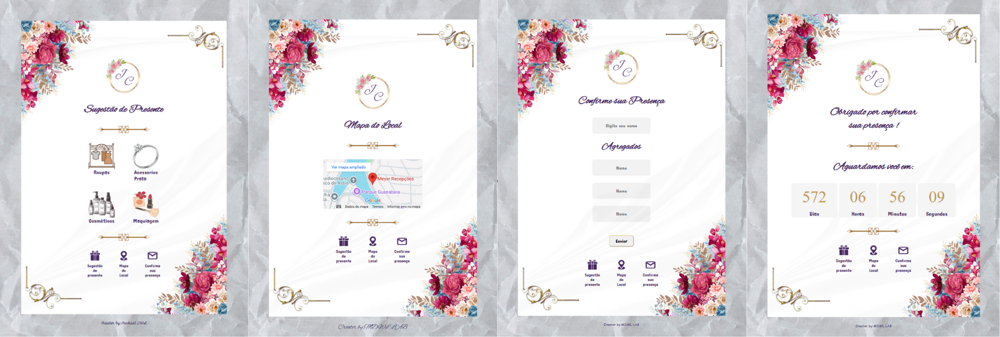

# 💌 Convite de 15 Anos — Interativo

Um convite digital **interativo** desenvolvido com **HTML, CSS e JavaScript**, criado para celebrar uma festa de 15 anos de forma moderna e criativa.  
A ideia é proporcionar uma praticidade, ao selecionar presentes, ter acesso ao mapa do local e confirmar a presença.

---

## ✨ Demonstração

🔗 [Acesse o convite online](https://floralmdwllab.netlify.app)  
*(ou abra o arquivo `index.html` localmente para visualizar)*

<p align="center">
  
</p>

---

## 🛠️ Tecnologias utilizadas

- **HTML5** — estrutura e conteúdo do convite  
- **CSS3** — design, responsividade e animações  
- **JavaScript** — interatividade, efeitos e lógica de exibição  

---

## 🚀 Como executar localmente

1. **Clone o repositório**
   ```bash
   git clone https://github.com/MichaelDWL/Convite-15y.git
   ```
2. **Acesse a pasta do projeto**
   ```bash
   cd Convite-15y
   ```
3. **Abra o arquivo principal**
   ```bash
   index.html
   ```
   > O convite será aberto diretamente no navegador.

---

## 📱 Recursos e funcionalidades

- ✨ Animações suaves com CSS  
- 🎂 Contagem regressiva para a festa    
- 🌙 Modo responsivo (funciona no celular e no computador)

---

## 💡 Personalização

Você pode facilmente adaptar o convite para outro evento (aniversário, casamento, formatura, etc).  
Basta alterar:
- Textos em `index.html`
- Cores e imagens em `style.css`
- Funções interativas em `script.js`

---

## 👨‍💻 Autor

Desenvolvido com 💜 por **[Michael Douglas G. da Silva](https://github.com/MichaelDWL)**

---

## 📄 Licença

Este projeto está sob a licença **MIT** — sinta-se à vontade para usar e modificar.

---
